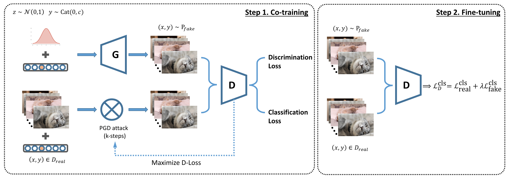

# Rob-GAN
*Rob-GAN: Generator, Discriminator and Adversarial Attacker*




## Requirements
Below is my running environment:

+ Python==3.6 + PyTorch>=0.4.0

## File structure

+ `train.[py, sh]`: GAN training (Step 1)
+ `fintune.[py, sh]`: Fine-tuning (Step 2)
+ `eval_inception.[py, sh]`: Evaluate the inception score
+ `acc_under_attack.[py, sh]`: Evaluate the accuracy under PGD attack
+ `/dis_models`: discriminators
+ `/gen_models`: generators
+ `/layers`: customized layers
+ `/miscs`: loss function, pgd-attack, etc.

## Step 0. Data Preparation
Follow the [SNGAN-projection](https://github.com/pfnet-research/sngan_projection#preprocess-dataset) steps to download and pre-process data.

Hereafter, I assume the 1000-class ImageNet data is stored in `/data1/sngan_data`, 143-class ImageNet data is stored in `/data1/sngan_dog_cat` and `/data1/sngan_dog_cat_val` (for validation).

## Step 1. Co-training the generator and discriminator
To run 143-ImageNet(64px) + AdvGAN, one can issue the following command (this can be done by modifying `train.sh`):
```bash
mkdir ./ckpt.adv-5.64px-143ImageNet
CUDA_VISIBLE_DEVICES=1,2,3,4,5 python ./train.py \
    --model resnet_64 \
    --nz 128 \
    --ngf 64 \
    --ndf 64 \
    --nclass 143 \
    --batch_size 64 \
    --start_width 4 \
    --dataset dog_and_cat_64 \
    --root /data1/sngan_dog_cat \
    --img_width 64 \
    --iter_d 5 \
    --out_f ckpt.adv-5.64px-143ImageNet \
    --ngpu 5 \   # use as many GPUs as you can!
    --starting_epoch 0 \
    --max_epoch 200 \
    --lr 0.0002 \ 
    --adv_steps 5 \ # PGD-attack iterations
    --epsilon 0.03125 \ # PGD-attack strength
    --our_loss # add this flag for our NEW loss
```
Key arguments: `--model`, `--nclass`, `--dataset`, `--img_width`, `--epsilon`. We keep other arguments unchanged through all experiments in our paper.

## Step 2. Fine-tuning
Similarly, we can do fine-tuning by running `./finetune.sh`
```bash
mkdir ckpt.adv-5.64px-143ImageNet.finetune # storing the output models
last_epoch=100 # you might change this
CUDA_VISIBLE_DEVICES=2,3,4,5 python finetune.py \
    --model resnet_64 \
    --netD ./ckpt.adv-5.64px-143ImageNet/dis_epoch_${last_epoch}.pth \
    --netG ./ckpt.adv-5.64px-143ImageNet/gen_epoch_${last_epoch}.pth \
    --ndf 64 \
    --ngf 64 \
    --nclass 143 \
    --dataset dog_and_cat_64 \
    --batch_size 128 \
    --root /data1/sngan_dog_cat \
    --img_width 64 \
    --steps 5 \
    --epsilon 0.03125 \
    --lam 0.3 \ # find a suitable weight for fake images, typically 0.3~0.8
    --lr 1.0e-3 \
    --ngpu 4 \ # use as many GPUs as you can!
    --out_f ckpt.adv-5.64px-143ImageNet.finetune \
    > >(tee log_finetune.txt) 2>error.txt
```
Key arguments: `$last_epoch`, `--model`, `--nclass`, `--dataset`, `--img_width`, `--epsilon`, `--lam`. We keep other arguments unchanged through all experiments in our paper.


## Step 3. Accuracy under attack
TODO

## Optional (TODO)
Evaluating inception scores, accuracy under attack, etc.

## Cite
Please consider to cite this paper if you find it helpful in your research:

    @inproceedings{liu2019robgan,
        title={Rob-GAN: Generator, Discriminator and Adversarial Attacker},
        author={Liu, Xuanqing and Hsieh, Cho-Jui},
        booktitle={Proceedings of the IEEE Conference on Computer Vision and Pattern Recognition},
        year={2019}
    }

## Acknowledgement
We would like to thank develpers of [SN-GAN](https://github.com/pfnet-research/sngan_projection) for providing the source code.
